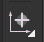

# CityScope-hardware

## Environment Setup
config path
| Name|Path|
---|---
|CITYSCOPE_LIB|`YOUR_FOLDER_PATH`/cityscope-hardware/libraries
### Config Symbol Library
Preferences -> Manage Symbol Libraries

| Nickname|Library Path|
---|---
|CityScope_Component|${CITYSCOPE_LIB}/CityScope_Component.kicad_sym|


### Config Footprint Library
Preferences -> Manage Footprint Libraries
| Nickname|Library Path|
---|---
|CityScope_Component|${CITYSCOPE_LIB}/CityScope_Component.pretty|
## Generate GERBER Files for Fabrication
### Gerber Plot
In ***File*** -> ***Plot...***

### Drill Plot
In ***File*** -> ***Plot...***


## Generate .pos Files for SMT
- Make sure you set origin point for you .pos file. In the fish head PCB, set FID2 fiducial as origin. Click the icon bellow in tool set to place your origin.

    
- Files -> Fabrication Outputs -> Component Placement (.pos)
    
    

- The following files will be generated.

    1. PROJECT-bottom-pos.csv
    2. PROJECT-top-pos.csv


- Convert the generated file to smt machine format by a python file in `tools/` folder. 
    ``` bash
    python3 convert_form.py --file-name ../YOUR_FOLDER_PATH/PROJECT-top-pos.csv
    ```
- An output.csv will be generated in `tools/`. 
- If the footprint name is too long, for example "JST_SH_BM03B-SRSS-TB_1x03-1MP_P1.00mm_Vertical
", please make it shorter or just delete this row.

## Generating BOM Sheet
### Requirements
- Install BOM extension:`Interactive Html Bom` in the Plugin And Content Manager.

### Generate BOM
- Open your `PCB Editor` -> ***Tools*** -> ***External Plugins*** -> ***Generate Interactive Html Bom***

## Release Files Structure
1. GERBERs/
2. bom/
3. PROJECT_v1_0.pdf
4. PROJECT_3d_v1_0.png
5. PROJECT_3d_v1_0.step
6. PROJECT_gerber_v1_0.zip

# Recommend Plugins
1. Interactive Html Bom
2. pcb-action-tools
3. KiKit
4. KiBuzzard

## KiKit Panelize
### Fisheye configuration
``` json
{
    "layout": {
        "hspace": "3.2mm",
        "vspace": "3.2mm",
        "rotation": "45deg",
        "rows": "6",
        "cols": "5"
    },
    "tabs": {
        "vwidth": "3.2mm",
        "hwidth": "3.2mm"
    },
    "cuts": {
        "type": "mousebites"
    },
    "framing": {
        "type": "frame",
        "hspace": "3.2mm",
        "vspace": "3.2mm",
        "width": "3.2mm"
    }
}
```